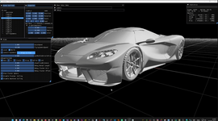
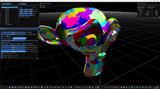
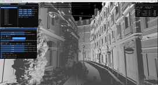

# AxEngine - Toy Engine for Experiments

## Meshlet LOD
- Mesh/Amplification Shader 
- CLOD
- Camera Frustum Culling
- Back Cone Culling

#### Video demo
https://www.youtube.com/watch?v=XZPXhJbOGDY&list=PLGt30576lHbPh-ElN7D1P9kr_dVqf1Jyu&index=3

#### References
- https://advances.realtimerendering.com/s2021/Karis_Nanite_SIGGRAPH_Advances_2021_final.pdf
- https://sites.google.com/site/monshonosuana/directxの話/directxの話-第195回?authuser=0
- https://sites.google.com/site/monshonosuana/directxの話/directxの話-第196回?authuser=0
- https://www.notion.so/Brief-Analysis-of-Nanite-94be60f292434ba3ae62fa4bcf7d9379
- https://www.elopezr.com/a-macro-view-of-nanite/
	

## Render Pipeline 
- Resource, memory management
- CPU/GPU Synchronization
- Render Graph - Reorder render passes
- Mega vertex / structured buffer with virtual memory pages
- Shader
	- output to DirectX / Vulkan from single source file
	- Reflection - extract buffer bind point and variables
	- Hot reload

## Rendering Hardware Interface
- DirectX 12 / Vulkan 1.4

## C++20 Experiments
- C++ modules in practice
- C++20 concept in practice 

## Others
- Small Array/String optimization
- linear algebra math with SIMD

